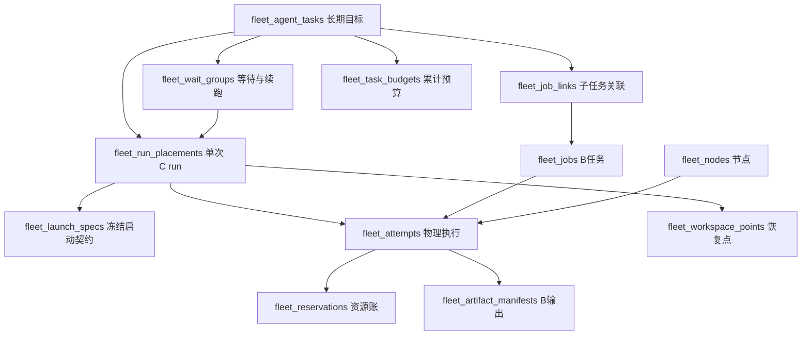

# ECS Fleet 库表参考（当前实现）

整理日期：2026-10-08。源码基线：`c46d990716d10ba6218b89be43a9c13abe053c14`。覆盖 28 张 Fleet 业务表，另有独立迁移版本表 `fleet_alembic_version`。

本文件依据当前 SQLAlchemy metadata 整理字段、外键、检查约束及索引，未连接数据库，也不表示已在阿里云部署。实际建库以 Alembic 迁移链为准；迁移中的触发器、数据修复和运行时锁不由 ORM metadata 完整表达。

## 1. 架构与存储边界

- Gateway 负责准入、调度、数据库事务、结果接受和恢复；Worker 负责自身节点的 Docker 执行和私有 journal。
- PostgreSQL 保存任务身份、执行状态、资源账、事件和恢复证据。Redis 不是这些事实的替代权威。
- NAS 保存输入、输出和 workspace 文件；表内保存清单、引用和接受事实。Worker journal 留在节点私有持久目录。
- `fleet_agent_tasks` 是长期目标，`fleet_run_placements` 是单次 C run，`fleet_jobs` 是 B 子任务，`fleet_attempts` 是物理执行。不能把四者的终态混为一谈。
- `user_id`、`thread_id` 和公共 `run_id` 与宿主系统身份关联；没有 SQL 外键的引用依靠服务事务和所有权检查，不能自行补建跨模块外键。

## 2. 主要关系（业务视图）

下图表示业务关联；完整 SQL 外键及复合身份约束见逐表定义。



## 3. 库表目录

| 表 | 用途 |
| --- | --- |
| [fleet_nodes](#fleet_nodes) | 工作节点身份、健康、资源上限和 profile 准入。 |
| [fleet_jobs](#fleet_jobs) | B 持久任务：提交幂等、排队、执行及接受的产物。 |
| [fleet_attempts](#fleet_attempts) | B/C 每次物理执行：节点 session、租约、启动授权和停止事实。 |
| [fleet_scheduler_tickets](#fleet_scheduler_tickets) | 定时任务在正式 run 创建前的容量准入票据。 |
| [fleet_reservations](#fleet_reservations) | 节点 CPU、内存和 Agent 槽位的持久资源账。 |
| [fleet_credentials](#fleet_credentials) | 节点凭据的 hash、有效期和撤销记录，不存明文 token。 |
| [fleet_artifact_manifests](#fleet_artifact_manifests) | B 已封存输出的文件清单。 |
| [fleet_input_manifests](#fleet_input_manifests) | 执行输入的封存清单。 |
| [fleet_recovery_events](#fleet_recovery_events) | 未知执行的人工恢复与审计记录。 |
| [fleet_job_invocations](#fleet_job_invocations) | 调用身份与原 job 的持久绑定，防请求重放重复提交。 |
| [fleet_agent_tasks](#fleet_agent_tasks) | C 长期目标；同一目标可包含多个 run/generation。 |
| [fleet_launch_specs](#fleet_launch_specs) | 冻结的 Agent 启动契约及摘要。 |
| [fleet_run_placements](#fleet_run_placements) | 某次 C run 的排队、节点放置和执行状态。 |
| [fleet_event_outbox](#fleet_event_outbox) | 已提交的远程事件及有序流。 |
| [fleet_stream_seals](#fleet_stream_seals) | 事件流封口与终态边界。 |
| [fleet_workspace_requests](#fleet_workspace_requests) | 工作空间发布请求及其身份。 |
| [fleet_workspace_manifests](#fleet_workspace_manifests) | 不可变工作空间文件清单。 |
| [fleet_workspace_points](#fleet_workspace_points) | 可恢复 checkpoint 与 workspace 的配对证据。 |
| [fleet_workspace_processes](#fleet_workspace_processes) | 工作空间发布相关的物理进程事实。 |
| [fleet_job_links](#fleet_job_links) | C 父目标/generation 与 B 子 job 的不可变关联。 |
| [fleet_wait_groups](#fleet_wait_groups) | sealed 等待组、恢复点和唯一 continuation 收据。 |
| [fleet_scheduling](#fleet_scheduling) | B/C 共用调度轮转记录。 |
| [fleet_task_operation_receipts](#fleet_task_operation_receipts) | 取消、暂停、继续等用户操作的幂等收据。 |
| [fleet_task_budgets](#fleet_task_budgets) | 跨 run/generation 累计的目标预算。 |
| [fleet_task_budget_charges](#fleet_task_budget_charges) | 执行消耗的持久预算记账。 |
| [fleet_model_reservations](#fleet_model_reservations) | 模型调用预算预留与结算。 |
| [fleet_task_budget_decisions](#fleet_task_budget_decisions) | 预算决策的持久收据。 |
| [fleet_scheduled_agent_tasks](#fleet_scheduled_agent_tasks) | 原始定时 occurrence 与长期目标的绑定及最终结算。 |

## 4. 字段、约束与索引

类型按 PostgreSQL dialect 展示；nullable 表示数据库是否允许 NULL。默认值是数据库 server default；没有默认值不表示服务不会显式赋值。

### fleet_nodes

工作节点身份、健康、资源上限和 profile 准入。

| 字段 | 类型 | 允许 NULL | 主键 | 数据库默认值 |
| --- | --- | --- | --- | --- |
| `id` | `VARCHAR(64)` | 否 | 是 | `—` |
| `name` | `VARCHAR(128)` | 否 |  | `—` |
| `profile_allowlist` | `JSONB` | 是 |  | `—` |
| `registered_by` | `VARCHAR(64)` | 是 |  | `—` |
| `admin_state` | `VARCHAR(16)` | 否 |  | `enabled` |
| `health` | `VARCHAR(16)` | 否 |  | `unknown` |
| `session_id` | `VARCHAR(64)` | 是 |  | `—` |
| `protocol_version` | `INTEGER` | 否 |  | `1` |
| `runtime_digest` | `VARCHAR(128)` | 是 |  | `—` |
| `agent_compatibility` | `JSONB` | 是 |  | `—` |
| `claim_kinds` | `JSONB` | 是 |  | `—` |
| `cpu_millis` | `INTEGER` | 否 |  | `—` |
| `memory_mib` | `INTEGER` | 否 |  | `—` |
| `agent_limit` | `INTEGER` | 否 |  | `0` |
| `last_seen_at` | `TIMESTAMP WITH TIME ZONE` | 是 |  | `—` |
| `created_at` | `TIMESTAMP WITH TIME ZONE` | 否 |  | `clock_timestamp()` |
| `updated_at` | `TIMESTAMP WITH TIME ZONE` | 否 |  | `clock_timestamp()` |

SQL 约束：

```sql
ALTER TABLE fleet_nodes ADD CONSTRAINT ck_fleet_nodes_admin CHECK (admin_state IN ('enabled','draining','disabled'));
ALTER TABLE fleet_nodes ADD CONSTRAINT ck_fleet_nodes_capacity CHECK (cpu_millis > 0 AND memory_mib > 0 AND agent_limit >= 0);
ALTER TABLE fleet_nodes ADD CONSTRAINT ck_fleet_nodes_health CHECK (health IN ('online','offline','unknown'));
ALTER TABLE fleet_nodes ADD CONSTRAINT ck_fleet_nodes_profiles CHECK (profile_allowlist IS NULL OR jsonb_typeof(profile_allowlist) = 'array');
ALTER TABLE fleet_nodes ADD PRIMARY KEY (id);
ALTER TABLE fleet_nodes ADD UNIQUE (name);
```

### fleet_jobs

B 持久任务：提交幂等、排队、执行及接受的产物。

| 字段 | 类型 | 允许 NULL | 主键 | 数据库默认值 |
| --- | --- | --- | --- | --- |
| `id` | `VARCHAR(64)` | 否 | 是 | `—` |
| `user_id` | `VARCHAR(64)` | 否 |  | `—` |
| `thread_id` | `VARCHAR(64)` | 否 |  | `—` |
| `source_run_id` | `VARCHAR(64)` | 是 |  | `—` |
| `tracking_task_id` | `VARCHAR(64)` | 否 |  | `—` |
| `idempotency_key` | `VARCHAR(128)` | 否 |  | `—` |
| `dedupe_group` | `VARCHAR(128)` | 是 |  | `—` |
| `spec` | `JSONB` | 否 |  | `—` |
| `state` | `VARCHAR(24)` | 否 |  | `staged` |
| `active_attempt_id` | `VARCHAR(64)` | 是 |  | `—` |
| `accepted_manifest_id` | `VARCHAR(64)` | 是 |  | `—` |
| `error` | `TEXT` | 是 |  | `—` |
| `staged_deadline` | `TIMESTAMP WITH TIME ZONE` | 否 |  | `clock_timestamp()` |
| `queue_deadline` | `TIMESTAMP WITH TIME ZONE` | 否 |  | `clock_timestamp()` |
| `queued_at` | `TIMESTAMP WITH TIME ZONE` | 是 |  | `—` |
| `cancel_requested_at` | `TIMESTAMP WITH TIME ZONE` | 是 |  | `—` |
| `finished_at` | `TIMESTAMP WITH TIME ZONE` | 是 |  | `—` |
| `created_at` | `TIMESTAMP WITH TIME ZONE` | 否 |  | `clock_timestamp()` |
| `updated_at` | `TIMESTAMP WITH TIME ZONE` | 否 |  | `clock_timestamp()` |

SQL 约束：

```sql
ALTER TABLE fleet_jobs ADD CONSTRAINT ck_fleet_jobs_state CHECK (state IN ('staged','queued','claimed','running','succeeded','failed','cancelled','unknown','quarantined'));
ALTER TABLE fleet_jobs ADD PRIMARY KEY (id);
ALTER TABLE fleet_jobs ADD CONSTRAINT uq_fleet_job_parent UNIQUE (id, user_id, thread_id, source_run_id);
ALTER TABLE fleet_jobs ADD CONSTRAINT uq_fleet_jobs_submission UNIQUE (user_id, idempotency_key);
ALTER TABLE fleet_jobs ADD CONSTRAINT uq_fleet_jobs_tracking UNIQUE (user_id, tracking_task_id);
```

索引（含 partial unique index）：

```sql
CREATE INDEX ix_fleet_jobs_due ON fleet_jobs (state, queue_deadline);
CREATE INDEX ix_fleet_jobs_thread ON fleet_jobs (user_id, thread_id, created_at);
CREATE UNIQUE INDEX uq_fleet_jobs_active_group ON fleet_jobs (user_id, dedupe_group) WHERE dedupe_group IS NOT NULL AND state IN ('staged','queued','claimed','running','unknown','quarantined');
```

### fleet_attempts

B/C 每次物理执行：节点 session、租约、启动授权和停止事实。

| 字段 | 类型 | 允许 NULL | 主键 | 数据库默认值 |
| --- | --- | --- | --- | --- |
| `id` | `VARCHAR(64)` | 否 | 是 | `—` |
| `kind` | `VARCHAR(16)` | 否 |  | `—` |
| `job_id` | `VARCHAR(64)` | 是 |  | `—` |
| `run_id` | `VARCHAR(64)` | 是 |  | `—` |
| `attempt_no` | `INTEGER` | 否 |  | `—` |
| `node_id` | `VARCHAR(64)` | 否 |  | `—` |
| `node_session_id` | `VARCHAR(64)` | 否 |  | `—` |
| `token_hash` | `VARCHAR(64)` | 否 |  | `—` |
| `state` | `VARCHAR(24)` | 否 |  | `claimed` |
| `process_ref` | `VARCHAR(128)` | 是 |  | `—` |
| `output_prefix` | `VARCHAR(512)` | 否 |  | `—` |
| `outcome` | `JSONB` | 是 |  | `—` |
| `launch_spec` | `JSONB` | 是 |  | `—` |
| `lease_expires_at` | `TIMESTAMP WITH TIME ZONE` | 否 |  | `clock_timestamp()` |
| `execution_deadline` | `TIMESTAMP WITH TIME ZONE` | 是 |  | `—` |
| `start_authorized_at` | `TIMESTAMP WITH TIME ZONE` | 是 |  | `—` |
| `started_at` | `TIMESTAMP WITH TIME ZONE` | 是 |  | `—` |
| `stopped_at` | `TIMESTAMP WITH TIME ZONE` | 是 |  | `—` |
| `finished_at` | `TIMESTAMP WITH TIME ZONE` | 是 |  | `—` |
| `created_at` | `TIMESTAMP WITH TIME ZONE` | 否 |  | `clock_timestamp()` |

SQL 约束：

```sql
ALTER TABLE fleet_attempts ADD CONSTRAINT ck_fleet_attempt_identity CHECK ((kind='job' AND job_id IS NOT NULL AND run_id IS NULL) OR (kind='agent' AND run_id IS NOT NULL AND job_id IS NULL));
ALTER TABLE fleet_attempts ADD CONSTRAINT ck_fleet_attempt_number CHECK (attempt_no > 0);
ALTER TABLE fleet_attempts ADD CONSTRAINT ck_fleet_attempt_state CHECK (state IN ('claimed','starting','running','succeeded','failed','cancelled','expired','unknown','quarantined'));
ALTER TABLE fleet_attempts ADD FOREIGN KEY(node_id) REFERENCES fleet_nodes (id);
ALTER TABLE fleet_attempts ADD FOREIGN KEY(job_id) REFERENCES fleet_jobs (id);
ALTER TABLE fleet_attempts ADD PRIMARY KEY (id);
ALTER TABLE fleet_attempts ADD CONSTRAINT uq_fleet_attempt_job_number UNIQUE (job_id, attempt_no);
ALTER TABLE fleet_attempts ADD CONSTRAINT uq_fleet_attempt_original_execution UNIQUE (id, run_id, node_id, node_session_id, token_hash, process_ref);
ALTER TABLE fleet_attempts ADD CONSTRAINT uq_fleet_attempt_run_identity UNIQUE (id, run_id);
ALTER TABLE fleet_attempts ADD CONSTRAINT uq_fleet_attempt_run_number UNIQUE (run_id, attempt_no);
```

索引（含 partial unique index）：

```sql
CREATE UNIQUE INDEX uq_fleet_attempt_job_active ON fleet_attempts (job_id) WHERE job_id IS NOT NULL AND state IN ('claimed','starting','running','unknown','quarantined');
CREATE UNIQUE INDEX uq_fleet_attempt_run_active ON fleet_attempts (run_id) WHERE run_id IS NOT NULL AND state IN ('claimed','starting','running','unknown','quarantined');
```

### fleet_scheduler_tickets

定时任务在正式 run 创建前的容量准入票据。

| 字段 | 类型 | 允许 NULL | 主键 | 数据库默认值 |
| --- | --- | --- | --- | --- |
| `id` | `VARCHAR(64)` | 否 | 是 | `—` |
| `occurrence_id` | `VARCHAR(64)` | 否 |  | `—` |
| `scheduled_task_id` | `VARCHAR(64)` | 否 |  | `—` |
| `user_id` | `VARCHAR(64)` | 否 |  | `—` |
| `thread_id` | `VARCHAR(64)` | 否 |  | `—` |
| `profile` | `VARCHAR(64)` | 否 |  | `—` |
| `node_id` | `VARCHAR(64)` | 否 |  | `—` |
| `node_session_id` | `VARCHAR(64)` | 否 |  | `—` |
| `lease_owner` | `VARCHAR(128)` | 否 |  | `—` |
| `run_id` | `VARCHAR(64)` | 是 |  | `—` |
| `state` | `VARCHAR(24)` | 否 |  | `held` |
| `expires_at` | `TIMESTAMP WITH TIME ZONE` | 否 |  | `clock_timestamp()` |
| `created_at` | `TIMESTAMP WITH TIME ZONE` | 否 |  | `clock_timestamp()` |
| `consumed_at` | `TIMESTAMP WITH TIME ZONE` | 是 |  | `—` |
| `released_at` | `TIMESTAMP WITH TIME ZONE` | 是 |  | `—` |

SQL 约束：

```sql
ALTER TABLE fleet_scheduler_tickets ADD CONSTRAINT ck_fleet_ticket_state CHECK (state IN ('held','consumed','released'));
ALTER TABLE fleet_scheduler_tickets ADD FOREIGN KEY(node_id) REFERENCES fleet_nodes (id);
ALTER TABLE fleet_scheduler_tickets ADD PRIMARY KEY (id);
```

索引（含 partial unique index）：

```sql
CREATE UNIQUE INDEX uq_fleet_ticket_live_occurrence ON fleet_scheduler_tickets (occurrence_id) WHERE state != 'released';
```

### fleet_reservations

节点 CPU、内存和 Agent 槽位的持久资源账。

| 字段 | 类型 | 允许 NULL | 主键 | 数据库默认值 |
| --- | --- | --- | --- | --- |
| `id` | `VARCHAR(64)` | 否 | 是 | `—` |
| `node_id` | `VARCHAR(64)` | 否 |  | `—` |
| `attempt_id` | `VARCHAR(64)` | 是 |  | `—` |
| `ticket_id` | `VARCHAR(64)` | 是 |  | `—` |
| `cpu_millis` | `INTEGER` | 否 |  | `—` |
| `memory_mib` | `INTEGER` | 否 |  | `—` |
| `agent_units` | `INTEGER` | 否 |  | `0` |
| `state` | `VARCHAR(24)` | 否 |  | `reserved` |
| `created_at` | `TIMESTAMP WITH TIME ZONE` | 否 |  | `clock_timestamp()` |
| `released_at` | `TIMESTAMP WITH TIME ZONE` | 是 |  | `—` |

SQL 约束：

```sql
ALTER TABLE fleet_reservations ADD CONSTRAINT ck_fleet_reservation_capacity CHECK (cpu_millis > 0 AND memory_mib > 0 AND agent_units >= 0);
ALTER TABLE fleet_reservations ADD CONSTRAINT ck_fleet_reservation_identity CHECK (attempt_id IS NOT NULL OR ticket_id IS NOT NULL);
ALTER TABLE fleet_reservations ADD CONSTRAINT ck_fleet_reservation_release CHECK ((state='released') = (released_at IS NOT NULL));
ALTER TABLE fleet_reservations ADD CONSTRAINT ck_fleet_reservation_state CHECK (state IN ('reserved','active','quarantined','released'));
ALTER TABLE fleet_reservations ADD FOREIGN KEY(node_id) REFERENCES fleet_nodes (id);
ALTER TABLE fleet_reservations ADD FOREIGN KEY(ticket_id) REFERENCES fleet_scheduler_tickets (id);
ALTER TABLE fleet_reservations ADD FOREIGN KEY(attempt_id) REFERENCES fleet_attempts (id);
ALTER TABLE fleet_reservations ADD PRIMARY KEY (id);
ALTER TABLE fleet_reservations ADD UNIQUE (attempt_id);
ALTER TABLE fleet_reservations ADD UNIQUE (ticket_id);
```

索引（含 partial unique index）：

```sql
CREATE INDEX ix_fleet_reservations_node ON fleet_reservations (node_id, state);
```

### fleet_credentials

节点凭据的 hash、有效期和撤销记录，不存明文 token。

| 字段 | 类型 | 允许 NULL | 主键 | 数据库默认值 |
| --- | --- | --- | --- | --- |
| `id` | `VARCHAR(64)` | 否 | 是 | `—` |
| `node_id` | `VARCHAR(64)` | 否 |  | `—` |
| `token_hash` | `VARCHAR(64)` | 否 |  | `—` |
| `expires_at` | `TIMESTAMP WITH TIME ZONE` | 否 |  | `clock_timestamp()` |
| `revoked_at` | `TIMESTAMP WITH TIME ZONE` | 是 |  | `—` |
| `created_at` | `TIMESTAMP WITH TIME ZONE` | 否 |  | `clock_timestamp()` |

SQL 约束：

```sql
ALTER TABLE fleet_credentials ADD FOREIGN KEY(node_id) REFERENCES fleet_nodes (id);
ALTER TABLE fleet_credentials ADD PRIMARY KEY (id);
ALTER TABLE fleet_credentials ADD UNIQUE (token_hash);
```

### fleet_artifact_manifests

B 已封存输出的文件清单。

| 字段 | 类型 | 允许 NULL | 主键 | 数据库默认值 |
| --- | --- | --- | --- | --- |
| `id` | `VARCHAR(64)` | 否 | 是 | `—` |
| `attempt_id` | `VARCHAR(64)` | 否 |  | `—` |
| `user_id` | `VARCHAR(64)` | 否 |  | `—` |
| `thread_id` | `VARCHAR(64)` | 否 |  | `—` |
| `output_prefix` | `VARCHAR(512)` | 否 |  | `—` |
| `files` | `JSONB` | 否 |  | `—` |
| `total_bytes` | `INTEGER` | 否 |  | `—` |
| `sealed_at` | `TIMESTAMP WITH TIME ZONE` | 否 |  | `clock_timestamp()` |

SQL 约束：

```sql
ALTER TABLE fleet_artifact_manifests ADD CONSTRAINT ck_fleet_manifest_bytes CHECK (total_bytes >= 0);
ALTER TABLE fleet_artifact_manifests ADD FOREIGN KEY(attempt_id) REFERENCES fleet_attempts (id);
ALTER TABLE fleet_artifact_manifests ADD PRIMARY KEY (id);
ALTER TABLE fleet_artifact_manifests ADD UNIQUE (attempt_id);
```

### fleet_input_manifests

执行输入的封存清单。

| 字段 | 类型 | 允许 NULL | 主键 | 数据库默认值 |
| --- | --- | --- | --- | --- |
| `id` | `VARCHAR(64)` | 否 | 是 | `—` |
| `user_id` | `VARCHAR(64)` | 否 |  | `—` |
| `thread_id` | `VARCHAR(64)` | 否 |  | `—` |
| `output_prefix` | `VARCHAR(512)` | 否 |  | `—` |
| `files` | `JSONB` | 否 |  | `—` |
| `total_bytes` | `INTEGER` | 否 |  | `—` |
| `sealed_at` | `TIMESTAMP WITH TIME ZONE` | 否 |  | `clock_timestamp()` |

SQL 约束：

```sql
ALTER TABLE fleet_input_manifests ADD CONSTRAINT ck_fleet_input_bytes CHECK (total_bytes >= 0);
ALTER TABLE fleet_input_manifests ADD PRIMARY KEY (id);
ALTER TABLE fleet_input_manifests ADD UNIQUE (output_prefix);
```

索引（含 partial unique index）：

```sql
CREATE INDEX ix_fleet_inputs_owner ON fleet_input_manifests (user_id, thread_id, sealed_at);
```

### fleet_recovery_events

未知执行的人工恢复与审计记录。

| 字段 | 类型 | 允许 NULL | 主键 | 数据库默认值 |
| --- | --- | --- | --- | --- |
| `id` | `VARCHAR(64)` | 否 | 是 | `—` |
| `job_id` | `VARCHAR(64)` | 否 |  | `—` |
| `attempt_id` | `VARCHAR(64)` | 否 |  | `—` |
| `operator_id` | `VARCHAR(64)` | 否 |  | `—` |
| `action` | `VARCHAR(32)` | 否 |  | `—` |
| `note` | `TEXT` | 否 |  | `—` |
| `created_at` | `TIMESTAMP WITH TIME ZONE` | 否 |  | `clock_timestamp()` |

SQL 约束：

```sql
ALTER TABLE fleet_recovery_events ADD CONSTRAINT ck_fleet_recovery_action CHECK (action = 'fail_stopped');
ALTER TABLE fleet_recovery_events ADD FOREIGN KEY(attempt_id) REFERENCES fleet_attempts (id);
ALTER TABLE fleet_recovery_events ADD FOREIGN KEY(job_id) REFERENCES fleet_jobs (id);
ALTER TABLE fleet_recovery_events ADD PRIMARY KEY (id);
ALTER TABLE fleet_recovery_events ADD UNIQUE (attempt_id);
```

索引（含 partial unique index）：

```sql
CREATE INDEX ix_fleet_recovery_job ON fleet_recovery_events (job_id, created_at);
```

### fleet_job_invocations

调用身份与原 job 的持久绑定，防请求重放重复提交。

| 字段 | 类型 | 允许 NULL | 主键 | 数据库默认值 |
| --- | --- | --- | --- | --- |
| `user_id` | `VARCHAR(64)` | 否 | 是 | `—` |
| `idempotency_key` | `VARCHAR(128)` | 否 | 是 | `—` |
| `thread_id` | `VARCHAR(64)` | 否 |  | `—` |
| `source_run_id` | `VARCHAR(64)` | 是 |  | `—` |
| `spec` | `JSONB` | 否 |  | `—` |
| `dedupe_group` | `VARCHAR(128)` | 是 |  | `—` |
| `job_id` | `VARCHAR(64)` | 否 |  | `—` |
| `created_at` | `TIMESTAMP WITH TIME ZONE` | 否 |  | `clock_timestamp()` |

SQL 约束：

```sql
ALTER TABLE fleet_job_invocations ADD FOREIGN KEY(job_id) REFERENCES fleet_jobs (id);
ALTER TABLE fleet_job_invocations ADD PRIMARY KEY (user_id, idempotency_key);
```

索引（含 partial unique index）：

```sql
CREATE INDEX ix_fleet_job_invocations_job ON fleet_job_invocations (job_id);
```

### fleet_agent_tasks

C 长期目标；同一目标可包含多个 run/generation。

| 字段 | 类型 | 允许 NULL | 主键 | 数据库默认值 |
| --- | --- | --- | --- | --- |
| `id` | `VARCHAR(64)` | 否 | 是 | `—` |
| `user_id` | `VARCHAR(64)` | 否 |  | `—` |
| `thread_id` | `VARCHAR(64)` | 否 |  | `—` |
| `state` | `VARCHAR(24)` | 否 |  | `queued` |
| `current_run_id` | `VARCHAR(64)` | 是 |  | `—` |
| `generation` | `INTEGER` | 否 |  | `1` |
| `deadline` | `TIMESTAMP WITH TIME ZONE` | 否 |  | `clock_timestamp()` |
| `continuation_budget` | `INTEGER` | 否 |  | `—` |
| `wait_group_id` | `VARCHAR(64)` | 是 |  | `—` |
| `accepted_workspace_point_id` | `VARCHAR(64)` | 是 |  | `—` |
| `cancel_requested_at` | `TIMESTAMP WITH TIME ZONE` | 是 |  | `—` |
| `created_at` | `TIMESTAMP WITH TIME ZONE` | 否 |  | `clock_timestamp()` |
| `updated_at` | `TIMESTAMP WITH TIME ZONE` | 否 |  | `clock_timestamp()` |

SQL 约束：

```sql
ALTER TABLE fleet_agent_tasks ADD CONSTRAINT ck_fleet_agent_task_budgets CHECK (generation > 0 AND continuation_budget >= 0);
ALTER TABLE fleet_agent_tasks ADD CONSTRAINT ck_fleet_agent_task_state CHECK (state IN ('queued','running','waiting_jobs','paused','input_required','unknown','finishing','recovery_required','succeeded','failed','cancelled','timed_out'));
ALTER TABLE fleet_agent_tasks ADD CONSTRAINT fk_fleet_agent_task_current_run FOREIGN KEY(current_run_id, id) REFERENCES fleet_run_placements (run_id, agent_task_id) DEFERRABLE INITIALLY DEFERRED;
ALTER TABLE fleet_agent_tasks ADD CONSTRAINT fk_fleet_agent_task_workspace_point FOREIGN KEY(accepted_workspace_point_id, id, user_id, thread_id) REFERENCES fleet_workspace_points (id, agent_task_id, user_id, thread_id) DEFERRABLE INITIALLY DEFERRED;
ALTER TABLE fleet_agent_tasks ADD PRIMARY KEY (id);
ALTER TABLE fleet_agent_tasks ADD CONSTRAINT uq_fleet_agent_task_owner UNIQUE (id, user_id, thread_id);
```

索引（含 partial unique index）：

```sql
CREATE UNIQUE INDEX uq_fleet_agent_task_active_thread ON fleet_agent_tasks (user_id, thread_id) WHERE state NOT IN ('succeeded','failed','cancelled','timed_out');
```

### fleet_launch_specs

冻结的 Agent 启动契约及摘要。

| 字段 | 类型 | 允许 NULL | 主键 | 数据库默认值 |
| --- | --- | --- | --- | --- |
| `id` | `VARCHAR(64)` | 否 | 是 | `—` |
| `run_id` | `VARCHAR(64)` | 否 |  | `—` |
| `agent_task_id` | `VARCHAR(64)` | 否 |  | `—` |
| `generation` | `INTEGER` | 否 |  | `—` |
| `user_id` | `VARCHAR(64)` | 否 |  | `—` |
| `thread_id` | `VARCHAR(64)` | 否 |  | `—` |
| `payload` | `JSONB` | 否 |  | `—` |
| `payload_digest` | `VARCHAR(71)` | 否 |  | `—` |
| `created_at` | `TIMESTAMP WITH TIME ZONE` | 否 |  | `clock_timestamp()` |

SQL 约束：

```sql
ALTER TABLE fleet_launch_specs ADD CONSTRAINT ck_fleet_launch_spec_digest CHECK (payload_digest ~ '^sha256:[a-f0-9]{64}$');
ALTER TABLE fleet_launch_specs ADD CONSTRAINT ck_fleet_launch_spec_generation CHECK (generation > 0);
ALTER TABLE fleet_launch_specs ADD CONSTRAINT fk_fleet_launch_spec_owner FOREIGN KEY(agent_task_id, user_id, thread_id) REFERENCES fleet_agent_tasks (id, user_id, thread_id);
ALTER TABLE fleet_launch_specs ADD PRIMARY KEY (id);
ALTER TABLE fleet_launch_specs ADD UNIQUE (run_id);
ALTER TABLE fleet_launch_specs ADD CONSTRAINT uq_fleet_launch_parent UNIQUE (run_id, agent_task_id, generation, user_id, thread_id);
ALTER TABLE fleet_launch_specs ADD CONSTRAINT uq_fleet_launch_spec_identity UNIQUE (id, run_id, agent_task_id, generation, user_id, thread_id);
ALTER TABLE fleet_launch_specs ADD CONSTRAINT uq_fleet_launch_workspace_digest UNIQUE (run_id, agent_task_id, generation, user_id, thread_id, payload_digest);
```

### fleet_run_placements

某次 C run 的排队、节点放置和执行状态。

| 字段 | 类型 | 允许 NULL | 主键 | 数据库默认值 |
| --- | --- | --- | --- | --- |
| `run_id` | `VARCHAR(64)` | 否 | 是 | `—` |
| `agent_task_id` | `VARCHAR(64)` | 否 |  | `—` |
| `generation` | `INTEGER` | 否 |  | `—` |
| `user_id` | `VARCHAR(64)` | 否 |  | `—` |
| `thread_id` | `VARCHAR(64)` | 否 |  | `—` |
| `requested_backend` | `VARCHAR(16)` | 否 |  | `—` |
| `node_id` | `VARCHAR(64)` | 是 |  | `—` |
| `profile` | `VARCHAR(64)` | 否 |  | `—` |
| `state` | `VARCHAR(24)` | 否 |  | `queued` |
| `active_attempt_id` | `VARCHAR(64)` | 是 |  | `—` |
| `launch_spec_ref` | `VARCHAR(64)` | 否 |  | `—` |
| `final_workspace_point_id` | `VARCHAR(64)` | 是 |  | `—` |
| `queue_deadline` | `TIMESTAMP WITH TIME ZONE` | 否 |  | `clock_timestamp()` |
| `created_at` | `TIMESTAMP WITH TIME ZONE` | 否 |  | `clock_timestamp()` |
| `updated_at` | `TIMESTAMP WITH TIME ZONE` | 否 |  | `clock_timestamp()` |

SQL 约束：

```sql
ALTER TABLE fleet_run_placements ADD CONSTRAINT ck_fleet_placement_backend CHECK (requested_backend IN ('remote','auto'));
ALTER TABLE fleet_run_placements ADD CONSTRAINT ck_fleet_placement_generation CHECK (generation > 0);
ALTER TABLE fleet_run_placements ADD CONSTRAINT ck_fleet_placement_state CHECK (state IN ('queued','claimed','running','unknown','finishing','recovery_required','succeeded','failed','cancelled','timed_out'));
ALTER TABLE fleet_run_placements ADD FOREIGN KEY(active_attempt_id) REFERENCES fleet_attempts (id);
ALTER TABLE fleet_run_placements ADD FOREIGN KEY(node_id) REFERENCES fleet_nodes (id);
ALTER TABLE fleet_run_placements ADD CONSTRAINT fk_fleet_placement_launch_identity FOREIGN KEY(launch_spec_ref, run_id, agent_task_id, generation, user_id, thread_id) REFERENCES fleet_launch_specs (id, run_id, agent_task_id, generation, user_id, thread_id);
ALTER TABLE fleet_run_placements ADD CONSTRAINT fk_fleet_placement_workspace_point FOREIGN KEY(final_workspace_point_id, run_id, agent_task_id, generation, user_id, thread_id) REFERENCES fleet_workspace_points (id, run_id, agent_task_id, generation, user_id, thread_id) DEFERRABLE INITIALLY DEFERRED;
ALTER TABLE fleet_run_placements ADD PRIMARY KEY (run_id);
ALTER TABLE fleet_run_placements ADD UNIQUE (launch_spec_ref);
ALTER TABLE fleet_run_placements ADD CONSTRAINT uq_fleet_placement_workspace_owner UNIQUE (run_id, agent_task_id, generation, user_id, thread_id);
ALTER TABLE fleet_run_placements ADD CONSTRAINT uq_fleet_run_placement_task UNIQUE (run_id, agent_task_id);
```

### fleet_event_outbox

已提交的远程事件及有序流。

| 字段 | 类型 | 允许 NULL | 主键 | 数据库默认值 |
| --- | --- | --- | --- | --- |
| `run_id` | `VARCHAR(64)` | 否 | 是 | `—` |
| `attempt_id` | `VARCHAR(64)` | 否 | 是 | `—` |
| `seq` | `BIGINT` | 否 | 是 | `—` |
| `generation` | `INTEGER` | 否 |  | `—` |
| `user_id` | `VARCHAR(64)` | 否 |  | `—` |
| `thread_id` | `VARCHAR(64)` | 否 |  | `—` |
| `launch_spec_digest` | `VARCHAR(71)` | 否 |  | `—` |
| `event_id` | `BIGINT` | 否 |  | `—` |
| `published_at` | `TIMESTAMP WITH TIME ZONE` | 是 |  | `—` |
| `created_at` | `TIMESTAMP WITH TIME ZONE` | 否 |  | `clock_timestamp()` |

SQL 约束：

```sql
ALTER TABLE fleet_event_outbox ADD CONSTRAINT ck_fleet_event_outbox_sequence CHECK (generation > 0 AND seq > 0);
ALTER TABLE fleet_event_outbox ADD FOREIGN KEY(run_id) REFERENCES fleet_run_placements (run_id);
ALTER TABLE fleet_event_outbox ADD FOREIGN KEY(attempt_id) REFERENCES fleet_attempts (id);
ALTER TABLE fleet_event_outbox ADD PRIMARY KEY (run_id, attempt_id, seq);
ALTER TABLE fleet_event_outbox ADD UNIQUE (event_id);
ALTER TABLE fleet_event_outbox ADD CONSTRAINT uq_fleet_event_outbox_thread_seq UNIQUE (thread_id, seq);
```

索引（含 partial unique index）：

```sql
CREATE INDEX ix_fleet_event_outbox_pending ON fleet_event_outbox (run_id, attempt_id, seq) WHERE published_at IS NULL;
```

### fleet_stream_seals

事件流封口与终态边界。

| 字段 | 类型 | 允许 NULL | 主键 | 数据库默认值 |
| --- | --- | --- | --- | --- |
| `run_id` | `VARCHAR(64)` | 否 | 是 | `—` |
| `attempt_id` | `VARCHAR(64)` | 否 | 是 | `—` |
| `generation` | `INTEGER` | 否 |  | `—` |
| `user_id` | `VARCHAR(64)` | 否 |  | `—` |
| `thread_id` | `VARCHAR(64)` | 否 |  | `—` |
| `launch_spec_digest` | `VARCHAR(71)` | 否 |  | `—` |
| `last_seq` | `BIGINT` | 否 |  | `—` |
| `core_status` | `VARCHAR(16)` | 否 |  | `—` |
| `source` | `VARCHAR(16)` | 否 |  | `—` |
| `created_at` | `TIMESTAMP WITH TIME ZONE` | 否 |  | `clock_timestamp()` |

SQL 约束：

```sql
ALTER TABLE fleet_stream_seals ADD CONSTRAINT ck_fleet_stream_seal_sequence CHECK (generation > 0 AND last_seq >= 0);
ALTER TABLE fleet_stream_seals ADD CONSTRAINT ck_fleet_stream_seal_source CHECK (source IN ('writer','physical_stop'));
ALTER TABLE fleet_stream_seals ADD CONSTRAINT ck_fleet_stream_seal_status CHECK (core_status IN ('success','error','interrupted','timeout'));
ALTER TABLE fleet_stream_seals ADD FOREIGN KEY(attempt_id) REFERENCES fleet_attempts (id);
ALTER TABLE fleet_stream_seals ADD FOREIGN KEY(run_id) REFERENCES fleet_run_placements (run_id);
ALTER TABLE fleet_stream_seals ADD PRIMARY KEY (run_id, attempt_id);
```

### fleet_workspace_requests

工作空间发布请求及其身份。

| 字段 | 类型 | 允许 NULL | 主键 | 数据库默认值 |
| --- | --- | --- | --- | --- |
| `id` | `VARCHAR(64)` | 否 | 是 | `—` |
| `run_id` | `VARCHAR(64)` | 否 |  | `—` |
| `agent_task_id` | `VARCHAR(64)` | 否 |  | `—` |
| `generation` | `INTEGER` | 否 |  | `—` |
| `user_id` | `VARCHAR(64)` | 否 |  | `—` |
| `thread_id` | `VARCHAR(64)` | 否 |  | `—` |
| `attempt_id` | `VARCHAR(64)` | 否 |  | `—` |
| `launch_spec_digest` | `VARCHAR(71)` | 否 |  | `—` |
| `node_id` | `VARCHAR(64)` | 否 |  | `—` |
| `node_session_id` | `VARCHAR(64)` | 否 |  | `—` |
| `token_stamp` | `VARCHAR(64)` | 否 |  | `—` |
| `process_ref` | `VARCHAR(128)` | 否 |  | `—` |
| `owner_worker_id` | `VARCHAR(128)` | 否 |  | `—` |
| `request_digest` | `VARCHAR(64)` | 否 |  | `—` |
| `checkpoint_ns` | `VARCHAR(64)` | 否 |  | `` |
| `checkpoint_id` | `VARCHAR(128)` | 否 |  | `—` |
| `kind` | `VARCHAR(16)` | 否 |  | `—` |
| `publication_key` | `VARCHAR(128)` | 否 |  | `—` |
| `presented_paths` | `JSONB` | 否 |  | `—` |
| `source_workspace_version` | `VARCHAR(128)` | 否 |  | `—` |
| `desired_core_status` | `VARCHAR(16)` | 是 |  | `—` |
| `desired_task_status` | `VARCHAR(24)` | 是 |  | `—` |
| `desired_placement_status` | `VARCHAR(24)` | 是 |  | `—` |
| `error` | `TEXT` | 是 |  | `—` |
| `stop_reason` | `VARCHAR(128)` | 是 |  | `—` |
| `state` | `VARCHAR(16)` | 否 |  | `requested` |
| `claim_nonce` | `VARCHAR(64)` | 是 |  | `—` |
| `claim_lease_expires_at` | `TIMESTAMP WITH TIME ZONE` | 是 |  | `—` |
| `barrier_epoch` | `BIGINT` | 否 |  | `0` |
| `candidate_manifest_id` | `VARCHAR(64)` | 是 |  | `—` |
| `rejection` | `TEXT` | 是 |  | `—` |
| `created_at` | `TIMESTAMP WITH TIME ZONE` | 否 |  | `clock_timestamp()` |
| `updated_at` | `TIMESTAMP WITH TIME ZONE` | 否 |  | `clock_timestamp()` |

SQL 约束：

```sql
ALTER TABLE fleet_workspace_requests ADD CONSTRAINT ck_fleet_workspace_request_boundary CHECK (checkpoint_ns = '' AND checkpoint_id <> '' AND publication_key <> '' AND source_workspace_version <> '');
ALTER TABLE fleet_workspace_requests ADD CONSTRAINT ck_fleet_workspace_request_claim CHECK (barrier_epoch >= 0 AND (claim_nonce IS NULL) = (claim_lease_expires_at IS NULL));
ALTER TABLE fleet_workspace_requests ADD CONSTRAINT ck_fleet_workspace_request_content CHECK (request_digest ~ '^[a-f0-9]{64}$' AND jsonb_typeof(presented_paths) = 'array');
ALTER TABLE fleet_workspace_requests ADD CONSTRAINT ck_fleet_workspace_request_digests CHECK (launch_spec_digest ~ '^sha256:[a-f0-9]{64}$' AND token_stamp ~ '^[a-f0-9]{64}$');
ALTER TABLE fleet_workspace_requests ADD CONSTRAINT ck_fleet_workspace_request_outcome CHECK (
(kind='partial' AND desired_core_status IS NULL AND desired_task_status IS NULL AND desired_placement_status IS NULL AND error IS NULL AND stop_reason IS NULL) OR (kind IN
('final','paused') AND desired_core_status IS NOT NULL AND desired_task_status IS NOT NULL AND desired_placement_status IS NOT NULL AND desired_core_status IN
('success','error','interrupted','timeout') AND desired_task_status IN ('succeeded','failed','cancelled','timed_out','paused','input_required','waiting_jobs') AND desired_placement_status IN
('succeeded','failed','cancelled','timed_out') AND (desired_task_status!='waiting_jobs' OR (kind='final' AND desired_core_status='success' AND desired_placement_status='succeeded' AND error IS NULL)))
);
ALTER TABLE fleet_workspace_requests ADD CONSTRAINT ck_fleet_workspace_request_owner CHECK (process_ref = 'fleet-' || attempt_id AND generation > 0 AND owner_worker_id = 'fleet-agent:' || attempt_id);
ALTER TABLE fleet_workspace_requests ADD CONSTRAINT ck_fleet_workspace_request_state CHECK (kind IN ('partial','final','paused') AND state IN ('requested','sealing','prepared','accepted','rejected'));
ALTER TABLE fleet_workspace_requests ADD CONSTRAINT fk_fleet_workspace_request_attempt FOREIGN KEY(attempt_id, run_id) REFERENCES fleet_attempts (id, run_id);
ALTER TABLE fleet_workspace_requests ADD CONSTRAINT fk_fleet_workspace_request_candidate FOREIGN KEY(candidate_manifest_id, run_id, agent_task_id, generation, user_id, thread_id, attempt_id, launch_spec_digest, node_id, node_session_id, token_stamp, process_ref, owner_worker_id, request_digest) REFERENCES fleet_workspace_manifests (id, run_id, agent_task_id, generation, user_id, thread_id, attempt_id, launch_spec_digest, node_id, node_session_id, token_stamp, process_ref, owner_worker_id, request_digest) DEFERRABLE INITIALLY DEFERRED;
ALTER TABLE fleet_workspace_requests ADD CONSTRAINT fk_fleet_workspace_request_execution FOREIGN KEY(attempt_id, run_id, node_id, node_session_id, token_stamp, process_ref) REFERENCES fleet_attempts (id, run_id, node_id, node_session_id, token_hash, process_ref);
ALTER TABLE fleet_workspace_requests ADD CONSTRAINT fk_fleet_workspace_request_launch FOREIGN KEY(run_id, agent_task_id, generation, user_id, thread_id, launch_spec_digest) REFERENCES fleet_launch_specs (run_id, agent_task_id, generation, user_id, thread_id, payload_digest);
ALTER TABLE fleet_workspace_requests ADD CONSTRAINT fk_fleet_workspace_request_placement FOREIGN KEY(run_id, agent_task_id, generation, user_id, thread_id) REFERENCES fleet_run_placements (run_id, agent_task_id, generation, user_id, thread_id);
ALTER TABLE fleet_workspace_requests ADD PRIMARY KEY (id);
ALTER TABLE fleet_workspace_requests ADD CONSTRAINT uq_fleet_workspace_request_identity UNIQUE (id, run_id, agent_task_id, generation, user_id, thread_id, attempt_id, launch_spec_digest, node_id, node_session_id, token_stamp, process_ref, owner_worker_id, request_digest, checkpoint_ns, checkpoint_id, kind, publication_key);
ALTER TABLE fleet_workspace_requests ADD CONSTRAINT uq_fleet_workspace_request_manifest_owner UNIQUE (request_digest, run_id, agent_task_id, generation, user_id, thread_id, attempt_id, launch_spec_digest, node_id, node_session_id, token_stamp, process_ref, owner_worker_id);
ALTER TABLE fleet_workspace_requests ADD CONSTRAINT uq_fleet_workspace_request_publication UNIQUE (attempt_id, checkpoint_id, kind, publication_key);
```

索引（含 partial unique index）：

```sql
CREATE INDEX ix_fleet_workspace_request_pending ON fleet_workspace_requests (state, claim_lease_expires_at);
```

### fleet_workspace_manifests

不可变工作空间文件清单。

| 字段 | 类型 | 允许 NULL | 主键 | 数据库默认值 |
| --- | --- | --- | --- | --- |
| `id` | `VARCHAR(64)` | 否 | 是 | `—` |
| `run_id` | `VARCHAR(64)` | 否 |  | `—` |
| `agent_task_id` | `VARCHAR(64)` | 否 |  | `—` |
| `generation` | `INTEGER` | 否 |  | `—` |
| `user_id` | `VARCHAR(64)` | 否 |  | `—` |
| `thread_id` | `VARCHAR(64)` | 否 |  | `—` |
| `attempt_id` | `VARCHAR(64)` | 否 |  | `—` |
| `launch_spec_digest` | `VARCHAR(71)` | 否 |  | `—` |
| `node_id` | `VARCHAR(64)` | 否 |  | `—` |
| `node_session_id` | `VARCHAR(64)` | 否 |  | `—` |
| `token_stamp` | `VARCHAR(64)` | 否 |  | `—` |
| `process_ref` | `VARCHAR(128)` | 否 |  | `—` |
| `owner_worker_id` | `VARCHAR(128)` | 否 |  | `—` |
| `request_digest` | `VARCHAR(64)` | 否 |  | `—` |
| `content_hash` | `VARCHAR(64)` | 否 |  | `—` |
| `schema_version` | `INTEGER` | 否 |  | `1` |
| `categories` | `JSONB` | 否 |  | `—` |
| `directories` | `JSONB` | 否 |  | `—` |
| `files` | `JSONB` | 否 |  | `—` |
| `total_bytes` | `BIGINT` | 否 |  | `—` |
| `nas_prefix` | `VARCHAR(512)` | 否 |  | `—` |
| `sealed_at` | `TIMESTAMP WITH TIME ZONE` | 否 |  | `clock_timestamp()` |

SQL 约束：

```sql
ALTER TABLE fleet_workspace_manifests ADD CONSTRAINT ck_fleet_workspace_manifest_content CHECK (schema_version=1 AND total_bytes>=0 AND id=content_hash AND content_hash ~ '^[a-f0-9]{64}$' AND request_digest ~ '^[a-f0-9]{64}$');
ALTER TABLE fleet_workspace_manifests ADD CONSTRAINT ck_fleet_workspace_manifest_digests CHECK (launch_spec_digest ~ '^sha256:[a-f0-9]{64}$' AND token_stamp ~ '^[a-f0-9]{64}$');
ALTER TABLE fleet_workspace_manifests ADD CONSTRAINT ck_fleet_workspace_manifest_inventory CHECK (categories = '["workspace","uploads","outputs"]'::jsonb AND jsonb_typeof(files)='array' AND jsonb_typeof(directories)='array');
ALTER TABLE fleet_workspace_manifests ADD CONSTRAINT ck_fleet_workspace_manifest_owner CHECK (process_ref = 'fleet-' || attempt_id AND generation > 0 AND owner_worker_id = 'fleet-agent:' || attempt_id);
ALTER TABLE fleet_workspace_manifests ADD CONSTRAINT fk_fleet_workspace_manifest_attempt FOREIGN KEY(attempt_id, run_id) REFERENCES fleet_attempts (id, run_id);
ALTER TABLE fleet_workspace_manifests ADD CONSTRAINT fk_fleet_workspace_manifest_execution FOREIGN KEY(attempt_id, run_id, node_id, node_session_id, token_stamp, process_ref) REFERENCES fleet_attempts (id, run_id, node_id, node_session_id, token_hash, process_ref);
ALTER TABLE fleet_workspace_manifests ADD CONSTRAINT fk_fleet_workspace_manifest_launch FOREIGN KEY(run_id, agent_task_id, generation, user_id, thread_id, launch_spec_digest) REFERENCES fleet_launch_specs (run_id, agent_task_id, generation, user_id, thread_id, payload_digest);
ALTER TABLE fleet_workspace_manifests ADD CONSTRAINT fk_fleet_workspace_manifest_placement FOREIGN KEY(run_id, agent_task_id, generation, user_id, thread_id) REFERENCES fleet_run_placements (run_id, agent_task_id, generation, user_id, thread_id);
ALTER TABLE fleet_workspace_manifests ADD CONSTRAINT fk_fleet_workspace_manifest_request FOREIGN KEY(request_digest, run_id, agent_task_id, generation, user_id, thread_id, attempt_id, launch_spec_digest, node_id, node_session_id, token_stamp, process_ref, owner_worker_id) REFERENCES fleet_workspace_requests (request_digest, run_id, agent_task_id, generation, user_id, thread_id, attempt_id, launch_spec_digest, node_id, node_session_id, token_stamp, process_ref, owner_worker_id);
ALTER TABLE fleet_workspace_manifests ADD PRIMARY KEY (id);
ALTER TABLE fleet_workspace_manifests ADD UNIQUE (nas_prefix);
ALTER TABLE fleet_workspace_manifests ADD CONSTRAINT uq_fleet_workspace_manifest_identity UNIQUE (id, run_id, agent_task_id, generation, user_id, thread_id, attempt_id, launch_spec_digest, node_id, node_session_id, token_stamp, process_ref, owner_worker_id, request_digest);
```

### fleet_workspace_points

可恢复 checkpoint 与 workspace 的配对证据。

| 字段 | 类型 | 允许 NULL | 主键 | 数据库默认值 |
| --- | --- | --- | --- | --- |
| `id` | `VARCHAR(64)` | 否 | 是 | `—` |
| `run_id` | `VARCHAR(64)` | 否 |  | `—` |
| `agent_task_id` | `VARCHAR(64)` | 否 |  | `—` |
| `generation` | `INTEGER` | 否 |  | `—` |
| `user_id` | `VARCHAR(64)` | 否 |  | `—` |
| `thread_id` | `VARCHAR(64)` | 否 |  | `—` |
| `attempt_id` | `VARCHAR(64)` | 否 |  | `—` |
| `launch_spec_digest` | `VARCHAR(71)` | 否 |  | `—` |
| `node_id` | `VARCHAR(64)` | 否 |  | `—` |
| `node_session_id` | `VARCHAR(64)` | 否 |  | `—` |
| `token_stamp` | `VARCHAR(64)` | 否 |  | `—` |
| `process_ref` | `VARCHAR(128)` | 否 |  | `—` |
| `owner_worker_id` | `VARCHAR(128)` | 否 |  | `—` |
| `request_id` | `VARCHAR(64)` | 否 |  | `—` |
| `request_digest` | `VARCHAR(64)` | 否 |  | `—` |
| `checkpoint_ns` | `VARCHAR(64)` | 否 |  | `` |
| `checkpoint_id` | `VARCHAR(128)` | 否 |  | `—` |
| `manifest_id` | `VARCHAR(64)` | 否 |  | `—` |
| `kind` | `VARCHAR(16)` | 否 |  | `—` |
| `publication_key` | `VARCHAR(128)` | 否 |  | `—` |
| `desired_core_status` | `VARCHAR(16)` | 是 |  | `—` |
| `desired_task_status` | `VARCHAR(24)` | 是 |  | `—` |
| `desired_placement_status` | `VARCHAR(24)` | 是 |  | `—` |
| `error` | `TEXT` | 是 |  | `—` |
| `stop_reason` | `VARCHAR(128)` | 是 |  | `—` |
| `accepted_at` | `TIMESTAMP WITH TIME ZONE` | 否 |  | `clock_timestamp()` |

SQL 约束：

```sql
ALTER TABLE fleet_workspace_points ADD CONSTRAINT ck_fleet_workspace_point_boundary CHECK (checkpoint_ns='' AND kind IN ('partial','final','paused'));
ALTER TABLE fleet_workspace_points ADD CONSTRAINT ck_fleet_workspace_point_digests CHECK (launch_spec_digest ~ '^sha256:[a-f0-9]{64}$' AND token_stamp ~ '^[a-f0-9]{64}$');
ALTER TABLE fleet_workspace_points ADD CONSTRAINT ck_fleet_workspace_point_outcome CHECK (
(kind='partial' AND desired_core_status IS NULL AND desired_task_status IS NULL AND desired_placement_status IS NULL AND error IS NULL AND stop_reason IS NULL) OR (kind IN
('final','paused') AND desired_core_status IS NOT NULL AND desired_task_status IS NOT NULL AND desired_placement_status IS NOT NULL AND desired_core_status IN
('success','error','interrupted','timeout') AND desired_task_status IN ('succeeded','failed','cancelled','timed_out','paused','input_required','waiting_jobs') AND desired_placement_status IN
('succeeded','failed','cancelled','timed_out') AND (desired_task_status!='waiting_jobs' OR (kind='final' AND desired_core_status='success' AND desired_placement_status='succeeded' AND error IS NULL)))
);
ALTER TABLE fleet_workspace_points ADD CONSTRAINT ck_fleet_workspace_point_owner CHECK (process_ref = 'fleet-' || attempt_id AND generation > 0 AND owner_worker_id = 'fleet-agent:' || attempt_id);
ALTER TABLE fleet_workspace_points ADD CONSTRAINT fk_fleet_workspace_point_attempt FOREIGN KEY(attempt_id, run_id) REFERENCES fleet_attempts (id, run_id);
ALTER TABLE fleet_workspace_points ADD CONSTRAINT fk_fleet_workspace_point_execution FOREIGN KEY(attempt_id, run_id, node_id, node_session_id, token_stamp, process_ref) REFERENCES fleet_attempts (id, run_id, node_id, node_session_id, token_hash, process_ref);
ALTER TABLE fleet_workspace_points ADD CONSTRAINT fk_fleet_workspace_point_launch FOREIGN KEY(run_id, agent_task_id, generation, user_id, thread_id, launch_spec_digest) REFERENCES fleet_launch_specs (run_id, agent_task_id, generation, user_id, thread_id, payload_digest);
ALTER TABLE fleet_workspace_points ADD CONSTRAINT fk_fleet_workspace_point_manifest FOREIGN KEY(manifest_id, run_id, agent_task_id, generation, user_id, thread_id, attempt_id, launch_spec_digest, node_id, node_session_id, token_stamp, process_ref, owner_worker_id, request_digest) REFERENCES fleet_workspace_manifests (id, run_id, agent_task_id, generation, user_id, thread_id, attempt_id, launch_spec_digest, node_id, node_session_id, token_stamp, process_ref, owner_worker_id, request_digest);
ALTER TABLE fleet_workspace_points ADD CONSTRAINT fk_fleet_workspace_point_placement FOREIGN KEY(run_id, agent_task_id, generation, user_id, thread_id) REFERENCES fleet_run_placements (run_id, agent_task_id, generation, user_id, thread_id);
ALTER TABLE fleet_workspace_points ADD CONSTRAINT fk_fleet_workspace_point_request FOREIGN KEY(request_id, run_id, agent_task_id, generation, user_id, thread_id, attempt_id, launch_spec_digest, node_id, node_session_id, token_stamp, process_ref, owner_worker_id, request_digest, checkpoint_ns, checkpoint_id, kind, publication_key) REFERENCES fleet_workspace_requests (id, run_id, agent_task_id, generation, user_id, thread_id, attempt_id, launch_spec_digest, node_id, node_session_id, token_stamp, process_ref, owner_worker_id, request_digest, checkpoint_ns, checkpoint_id, kind, publication_key);
ALTER TABLE fleet_workspace_points ADD PRIMARY KEY (id);
ALTER TABLE fleet_workspace_points ADD UNIQUE (request_id);
ALTER TABLE fleet_workspace_points ADD CONSTRAINT uq_fleet_workspace_point_run_owner UNIQUE (id, run_id, agent_task_id, generation, user_id, thread_id);
ALTER TABLE fleet_workspace_points ADD CONSTRAINT uq_fleet_workspace_point_task_owner UNIQUE (id, agent_task_id, user_id, thread_id);
```

索引（含 partial unique index）：

```sql
CREATE UNIQUE INDEX uq_fleet_workspace_point_final_run ON fleet_workspace_points (run_id) WHERE kind IN ('final','paused');
```

### fleet_workspace_processes

工作空间发布相关的物理进程事实。

| 字段 | 类型 | 允许 NULL | 主键 | 数据库默认值 |
| --- | --- | --- | --- | --- |
| `run_id` | `VARCHAR(64)` | 否 |  | `—` |
| `agent_task_id` | `VARCHAR(64)` | 否 |  | `—` |
| `generation` | `INTEGER` | 否 |  | `—` |
| `user_id` | `VARCHAR(64)` | 否 |  | `—` |
| `thread_id` | `VARCHAR(64)` | 否 |  | `—` |
| `attempt_id` | `VARCHAR(64)` | 否 | 是 | `—` |
| `launch_spec_digest` | `VARCHAR(71)` | 否 |  | `—` |
| `node_id` | `VARCHAR(64)` | 否 |  | `—` |
| `node_session_id` | `VARCHAR(64)` | 否 |  | `—` |
| `token_stamp` | `VARCHAR(64)` | 否 |  | `—` |
| `process_ref` | `VARCHAR(128)` | 否 |  | `—` |
| `owner_worker_id` | `VARCHAR(128)` | 否 |  | `—` |
| `pid` | `INTEGER` | 否 | 是 | `—` |
| `start_ticks` | `BIGINT` | 否 | 是 | `—` |
| `role` | `VARCHAR(16)` | 否 |  | `—` |
| `tool_execution_id` | `VARCHAR(64)` | 否 |  | `—` |
| `start_nonce` | `VARCHAR(64)` | 否 |  | `—` |
| `source_digest` | `VARCHAR(64)` | 否 |  | `—` |
| `supervisor_pid` | `INTEGER` | 是 |  | `—` |
| `supervisor_start_ticks` | `BIGINT` | 是 |  | `—` |
| `supervisor_role` | `VARCHAR(16)` | 否 |  | `supervisor` |
| `state` | `VARCHAR(16)` | 否 |  | `registered` |
| `registered_at` | `TIMESTAMP WITH TIME ZONE` | 否 |  | `clock_timestamp()` |
| `settled_at` | `TIMESTAMP WITH TIME ZONE` | 是 |  | `—` |

SQL 约束：

```sql
ALTER TABLE fleet_workspace_processes ADD CONSTRAINT ck_fleet_workspace_process_digests CHECK (launch_spec_digest ~ '^sha256:[a-f0-9]{64}$' AND token_stamp ~ '^[a-f0-9]{64}$');
ALTER TABLE fleet_workspace_processes ADD CONSTRAINT ck_fleet_workspace_process_identity CHECK (pid > 0 AND start_ticks > 0 AND tool_execution_id <> '' AND source_digest ~ '^[a-f0-9]{64}$' AND start_nonce ~ '^[a-f0-9]{64}$');
ALTER TABLE fleet_workspace_processes ADD CONSTRAINT ck_fleet_workspace_process_owner CHECK (process_ref = 'fleet-' || attempt_id AND generation > 0 AND owner_worker_id = 'fleet-agent:' || attempt_id);
ALTER TABLE fleet_workspace_processes ADD CONSTRAINT ck_fleet_workspace_process_parent CHECK ((role='supervisor' AND supervisor_pid IS NULL AND supervisor_start_ticks IS NULL) OR (role='shell' AND supervisor_pid IS NOT NULL AND supervisor_start_ticks IS NOT NULL AND supervisor_pid > 0 AND supervisor_start_ticks > 0 AND supervisor_role='supervisor'));
ALTER TABLE fleet_workspace_processes ADD CONSTRAINT ck_fleet_workspace_process_state CHECK (role IN ('supervisor','shell') AND state IN ('registered','settled') AND (state='registered')=(settled_at IS NULL));
ALTER TABLE fleet_workspace_processes ADD CONSTRAINT fk_fleet_workspace_process_attempt FOREIGN KEY(attempt_id, run_id) REFERENCES fleet_attempts (id, run_id);
ALTER TABLE fleet_workspace_processes ADD CONSTRAINT fk_fleet_workspace_process_execution FOREIGN KEY(attempt_id, run_id, node_id, node_session_id, token_stamp, process_ref) REFERENCES fleet_attempts (id, run_id, node_id, node_session_id, token_hash, process_ref);
ALTER TABLE fleet_workspace_processes ADD CONSTRAINT fk_fleet_workspace_process_launch FOREIGN KEY(run_id, agent_task_id, generation, user_id, thread_id, launch_spec_digest) REFERENCES fleet_launch_specs (run_id, agent_task_id, generation, user_id, thread_id, payload_digest);
ALTER TABLE fleet_workspace_processes ADD CONSTRAINT fk_fleet_workspace_process_placement FOREIGN KEY(run_id, agent_task_id, generation, user_id, thread_id) REFERENCES fleet_run_placements (run_id, agent_task_id, generation, user_id, thread_id);
ALTER TABLE fleet_workspace_processes ADD CONSTRAINT fk_fleet_workspace_process_supervisor FOREIGN KEY(attempt_id, supervisor_pid, supervisor_start_ticks, tool_execution_id, supervisor_role) REFERENCES fleet_workspace_processes (attempt_id, pid, start_ticks, tool_execution_id, role);
ALTER TABLE fleet_workspace_processes ADD PRIMARY KEY (attempt_id, pid, start_ticks);
ALTER TABLE fleet_workspace_processes ADD CONSTRAINT uq_fleet_workspace_process_parent UNIQUE (attempt_id, pid, start_ticks, tool_execution_id, role);
```

索引（含 partial unique index）：

```sql
CREATE INDEX ix_fleet_workspace_process_owner ON fleet_workspace_processes (attempt_id, state);
```

### fleet_job_links

C 父目标/generation 与 B 子 job 的不可变关联。

| 字段 | 类型 | 允许 NULL | 主键 | 数据库默认值 |
| --- | --- | --- | --- | --- |
| `job_id` | `VARCHAR(64)` | 否 | 是 | `—` |
| `agent_task_id` | `VARCHAR(64)` | 否 |  | `—` |
| `generation` | `INTEGER` | 否 |  | `—` |
| `parent_run_id` | `VARCHAR(64)` | 否 |  | `—` |
| `user_id` | `VARCHAR(64)` | 否 |  | `—` |
| `thread_id` | `VARCHAR(64)` | 否 |  | `—` |
| `link_mode` | `VARCHAR(16)` | 否 |  | `—` |
| `created_at` | `TIMESTAMP WITH TIME ZONE` | 否 |  | `clock_timestamp()` |

SQL 约束：

```sql
ALTER TABLE fleet_job_links ADD CHECK (generation > 0 AND link_mode IN ('awaited','detached'));
ALTER TABLE fleet_job_links ADD FOREIGN KEY(job_id, user_id, thread_id, parent_run_id) REFERENCES fleet_jobs (id, user_id, thread_id, source_run_id);
ALTER TABLE fleet_job_links ADD FOREIGN KEY(parent_run_id, agent_task_id, generation, user_id, thread_id) REFERENCES fleet_launch_specs (run_id, agent_task_id, generation, user_id, thread_id);
ALTER TABLE fleet_job_links ADD PRIMARY KEY (job_id);
ALTER TABLE fleet_job_links ADD UNIQUE (agent_task_id, generation, job_id);
```

### fleet_wait_groups

sealed 等待组、恢复点和唯一 continuation 收据。

| 字段 | 类型 | 允许 NULL | 主键 | 数据库默认值 |
| --- | --- | --- | --- | --- |
| `id` | `VARCHAR(64)` | 否 | 是 | `—` |
| `continuation_key` | `VARCHAR(128)` | 否 |  | `—` |
| `agent_task_id` | `VARCHAR(64)` | 否 |  | `—` |
| `generation` | `INTEGER` | 否 |  | `—` |
| `parent_run_id` | `VARCHAR(64)` | 否 |  | `—` |
| `user_id` | `VARCHAR(64)` | 否 |  | `—` |
| `thread_id` | `VARCHAR(64)` | 否 |  | `—` |
| `job_ids` | `JSONB` | 否 |  | `—` |
| `policy` | `VARCHAR(24)` | 否 |  | `all_settled` |
| `state` | `VARCHAR(24)` | 否 |  | `sealed` |
| `checkpoint_id` | `VARCHAR(64)` | 是 |  | `—` |
| `workspace_point_id` | `VARCHAR(64)` | 是 |  | `—` |
| `delivery_owner` | `VARCHAR(128)` | 是 |  | `—` |
| `continuation_run_id` | `VARCHAR(64)` | 是 |  | `—` |
| `dispatched_at` | `TIMESTAMP WITH TIME ZONE` | 是 |  | `—` |
| `created_at` | `TIMESTAMP WITH TIME ZONE` | 否 |  | `clock_timestamp()` |

SQL 约束：

```sql
ALTER TABLE fleet_wait_groups ADD CHECK (generation > 0 AND policy='all_settled');
ALTER TABLE fleet_wait_groups ADD CHECK (jsonb_typeof(job_ids)='array' AND jsonb_array_length(job_ids)>0);
ALTER TABLE fleet_wait_groups ADD FOREIGN KEY(continuation_run_id) REFERENCES fleet_run_placements (run_id);
ALTER TABLE fleet_wait_groups ADD FOREIGN KEY(parent_run_id, agent_task_id, generation, user_id, thread_id) REFERENCES fleet_launch_specs (run_id, agent_task_id, generation, user_id, thread_id);
ALTER TABLE fleet_wait_groups ADD PRIMARY KEY (id);
ALTER TABLE fleet_wait_groups ADD UNIQUE (continuation_run_id);
ALTER TABLE fleet_wait_groups ADD UNIQUE (continuation_key);
```

### fleet_scheduling

B/C 共用调度轮转记录。

| 字段 | 类型 | 允许 NULL | 主键 | 数据库默认值 |
| --- | --- | --- | --- | --- |
| `id` | `VARCHAR(16)` | 否 | 是 | `—` |
| `next_kind` | `VARCHAR(16)` | 否 |  | `job` |

SQL 约束：

```sql
ALTER TABLE fleet_scheduling ADD CONSTRAINT ck_fleet_scheduling_turn CHECK (id='shared' AND next_kind IN ('job','agent'));
ALTER TABLE fleet_scheduling ADD PRIMARY KEY (id);
```

### fleet_task_operation_receipts

取消、暂停、继续等用户操作的幂等收据。

| 字段 | 类型 | 允许 NULL | 主键 | 数据库默认值 |
| --- | --- | --- | --- | --- |
| `id` | `VARCHAR(64)` | 否 | 是 | `—` |
| `agent_task_id` | `VARCHAR(64)` | 否 |  | `—` |
| `user_id` | `VARCHAR(64)` | 否 |  | `—` |
| `thread_id` | `VARCHAR(64)` | 否 |  | `—` |
| `operation` | `VARCHAR(32)` | 否 |  | `—` |
| `idempotency_key` | `VARCHAR(128)` | 否 |  | `—` |
| `request_digest` | `VARCHAR(64)` | 是 |  | `—` |
| `source_point_generation` | `INTEGER` | 是 |  | `—` |
| `preceding_receipt_id` | `VARCHAR(64)` | 是 |  | `—` |
| `stopped_run_id` | `VARCHAR(64)` | 是 |  | `—` |
| `source_generation` | `INTEGER` | 否 |  | `—` |
| `target_generation` | `INTEGER` | 否 |  | `—` |
| `source_run_id` | `VARCHAR(64)` | 是 |  | `—` |
| `source_workspace_point_id` | `VARCHAR(128)` | 是 |  | `—` |
| `source_checkpoint_id` | `VARCHAR(128)` | 是 |  | `—` |
| `wait_group_id` | `VARCHAR(64)` | 是 |  | `—` |
| `admitted_run_id` | `VARCHAR(64)` | 是 |  | `—` |
| `state` | `VARCHAR(16)` | 否 |  | `—` |
| `created_at` | `TIMESTAMP WITH TIME ZONE` | 否 |  | `clock_timestamp()` |

SQL 约束：

```sql
ALTER TABLE fleet_task_operation_receipts ADD CONSTRAINT ck_fleet_task_operation_generation CHECK (source_generation > 0 AND target_generation >= source_generation);
ALTER TABLE fleet_task_operation_receipts ADD FOREIGN KEY(agent_task_id) REFERENCES fleet_agent_tasks (id);
ALTER TABLE fleet_task_operation_receipts ADD PRIMARY KEY (id);
ALTER TABLE fleet_task_operation_receipts ADD UNIQUE (admitted_run_id);
ALTER TABLE fleet_task_operation_receipts ADD CONSTRAINT uq_fleet_task_operation_key UNIQUE (agent_task_id, operation, idempotency_key);
```

### fleet_task_budgets

跨 run/generation 累计的目标预算。

| 字段 | 类型 | 允许 NULL | 主键 | 数据库默认值 |
| --- | --- | --- | --- | --- |
| `agent_task_id` | `VARCHAR(64)` | 否 | 是 | `—` |
| `run_limit` | `BIGINT` | 否 |  | `—` |
| `job_limit` | `BIGINT` | 否 |  | `—` |
| `token_limit` | `BIGINT` | 否 |  | `—` |
| `admitted_runs` | `BIGINT` | 否 |  | `0` |
| `submitted_jobs` | `BIGINT` | 否 |  | `0` |
| `spent_tokens` | `BIGINT` | 否 |  | `0` |
| `reserved_tokens` | `BIGINT` | 否 |  | `0` |
| `legacy_usage_unknown` | `BOOLEAN` | 否 |  | `false` |
| `blocked_reason` | `VARCHAR(128)` | 是 |  | `—` |
| `created_at` | `TIMESTAMP WITH TIME ZONE` | 否 |  | `clock_timestamp()` |

SQL 约束：

```sql
ALTER TABLE fleet_task_budgets ADD CONSTRAINT ck_fleet_task_budget_limits CHECK (run_limit >= 0 AND job_limit >= 0 AND token_limit >= 0 AND admitted_runs >= 0 AND submitted_jobs >= 0 AND spent_tokens >= 0 AND reserved_tokens >= 0 AND admitted_runs <= run_limit AND submitted_jobs <= job_limit AND spent_tokens + reserved_tokens <= token_limit);
ALTER TABLE fleet_task_budgets ADD FOREIGN KEY(agent_task_id) REFERENCES fleet_agent_tasks (id);
ALTER TABLE fleet_task_budgets ADD PRIMARY KEY (agent_task_id);
```

### fleet_task_budget_charges

执行消耗的持久预算记账。

| 字段 | 类型 | 允许 NULL | 主键 | 数据库默认值 |
| --- | --- | --- | --- | --- |
| `agent_task_id` | `VARCHAR(64)` | 否 | 是 | `—` |
| `kind` | `VARCHAR(8)` | 否 | 是 | `—` |
| `logical_id` | `VARCHAR(64)` | 否 | 是 | `—` |
| `generation` | `INTEGER` | 否 |  | `—` |
| `created_at` | `TIMESTAMP WITH TIME ZONE` | 否 |  | `clock_timestamp()` |

SQL 约束：

```sql
ALTER TABLE fleet_task_budget_charges ADD CONSTRAINT ck_fleet_task_budget_charge CHECK (kind IN ('run','job') AND generation > 0);
ALTER TABLE fleet_task_budget_charges ADD FOREIGN KEY(agent_task_id) REFERENCES fleet_task_budgets (agent_task_id);
ALTER TABLE fleet_task_budget_charges ADD PRIMARY KEY (agent_task_id, kind, logical_id);
```

### fleet_model_reservations

模型调用预算预留与结算。

| 字段 | 类型 | 允许 NULL | 主键 | 数据库默认值 |
| --- | --- | --- | --- | --- |
| `id` | `VARCHAR(64)` | 否 | 是 | `—` |
| `agent_task_id` | `VARCHAR(64)` | 否 |  | `—` |
| `generation` | `INTEGER` | 否 |  | `—` |
| `run_id` | `VARCHAR(64)` | 否 |  | `—` |
| `attempt_id` | `VARCHAR(64)` | 否 |  | `—` |
| `node_id` | `VARCHAR(64)` | 否 |  | `—` |
| `node_session_id` | `VARCHAR(64)` | 否 |  | `—` |
| `token_stamp` | `VARCHAR(64)` | 否 |  | `—` |
| `provider_contract` | `JSONB` | 否 |  | `—` |
| `request_digest` | `VARCHAR(64)` | 否 |  | `—` |
| `input_bound` | `BIGINT` | 否 |  | `—` |
| `output_bound` | `BIGINT` | 否 |  | `—` |
| `reserved_tokens` | `BIGINT` | 否 |  | `—` |
| `state` | `VARCHAR(16)` | 否 |  | `—` |
| `measured_usage` | `JSONB` | 是 |  | `—` |
| `unknown_reason` | `VARCHAR(128)` | 是 |  | `—` |
| `created_at` | `TIMESTAMP WITH TIME ZONE` | 否 |  | `clock_timestamp()` |

SQL 约束：

```sql
ALTER TABLE fleet_model_reservations ADD CONSTRAINT ck_fleet_model_reservation CHECK (state IN ('reserved','settled','unknown') AND generation > 0 AND input_bound > 0 AND output_bound > 0 AND reserved_tokens = input_bound + output_bound);
ALTER TABLE fleet_model_reservations ADD FOREIGN KEY(agent_task_id) REFERENCES fleet_task_budgets (agent_task_id);
ALTER TABLE fleet_model_reservations ADD FOREIGN KEY(attempt_id) REFERENCES fleet_attempts (id);
ALTER TABLE fleet_model_reservations ADD PRIMARY KEY (id);
```

索引（含 partial unique index）：

```sql
CREATE INDEX ix_fleet_model_reservations_task ON fleet_model_reservations (agent_task_id, state);
```

### fleet_task_budget_decisions

预算决策的持久收据。

| 字段 | 类型 | 允许 NULL | 主键 | 数据库默认值 |
| --- | --- | --- | --- | --- |
| `id` | `VARCHAR(64)` | 否 | 是 | `—` |
| `agent_task_id` | `VARCHAR(64)` | 否 |  | `—` |
| `user_id` | `VARCHAR(64)` | 否 |  | `—` |
| `thread_id` | `VARCHAR(64)` | 否 |  | `—` |
| `generation` | `INTEGER` | 否 |  | `—` |
| `source_run_id` | `VARCHAR(64)` | 是 |  | `—` |
| `request_digest` | `VARCHAR(64)` | 是 |  | `—` |
| `reason` | `VARCHAR(128)` | 否 |  | `—` |
| `created_at` | `TIMESTAMP WITH TIME ZONE` | 否 |  | `clock_timestamp()` |

SQL 约束：

```sql
ALTER TABLE fleet_task_budget_decisions ADD FOREIGN KEY(agent_task_id) REFERENCES fleet_task_budgets (agent_task_id);
ALTER TABLE fleet_task_budget_decisions ADD PRIMARY KEY (id);
```

### fleet_scheduled_agent_tasks

原始定时 occurrence 与长期目标的绑定及最终结算。

| 字段 | 类型 | 允许 NULL | 主键 | 数据库默认值 |
| --- | --- | --- | --- | --- |
| `occurrence_id` | `VARCHAR(64)` | 否 | 是 | `—` |
| `scheduled_task_id` | `VARCHAR(64)` | 否 |  | `—` |
| `user_id` | `VARCHAR(64)` | 否 |  | `—` |
| `thread_id` | `VARCHAR(64)` | 否 |  | `—` |
| `original_run_id` | `VARCHAR(64)` | 否 |  | `—` |
| `agent_task_id` | `VARCHAR(64)` | 否 |  | `—` |
| `source_generation` | `INTEGER` | 否 |  | `—` |
| `state` | `VARCHAR(16)` | 否 |  | `pending` |
| `resolution_kind` | `VARCHAR(16)` | 是 |  | `—` |
| `resolved_run_id` | `VARCHAR(64)` | 是 |  | `—` |
| `resolved_generation` | `INTEGER` | 是 |  | `—` |
| `resolved_attempt_id` | `VARCHAR(64)` | 是 |  | `—` |
| `resolved_node_session_id` | `VARCHAR(64)` | 是 |  | `—` |
| `resolved_workspace_point_id` | `VARCHAR(64)` | 是 |  | `—` |
| `resolved_operation_id` | `VARCHAR(64)` | 是 |  | `—` |
| `resolved_status` | `VARCHAR(24)` | 是 |  | `—` |
| `resolved_error` | `TEXT` | 是 |  | `—` |
| `resolved_at` | `TIMESTAMP WITH TIME ZONE` | 是 |  | `—` |
| `created_at` | `TIMESTAMP WITH TIME ZONE` | 否 |  | `clock_timestamp()` |

SQL 约束：

```sql
ALTER TABLE fleet_scheduled_agent_tasks ADD CONSTRAINT ck_fleet_scheduled_agent_identity CHECK (source_generation > 0 AND state IN ('pending','resolved'));
ALTER TABLE fleet_scheduled_agent_tasks ADD CONSTRAINT ck_fleet_scheduled_agent_resolution CHECK ((state='pending' AND resolution_kind IS NULL AND resolved_run_id IS NULL AND resolved_generation IS NULL AND resolved_attempt_id IS NULL AND resolved_node_session_id IS NULL AND resolved_workspace_point_id IS NULL AND resolved_operation_id IS NULL AND resolved_status IS NULL AND resolved_error IS NULL AND resolved_at IS NULL) OR (state='resolved' AND resolution_kind IS NOT NULL AND resolved_run_id IS NOT NULL AND resolved_generation IS NOT NULL AND resolved_generation >= source_generation AND resolved_status IS NOT NULL AND resolved_status IN ('succeeded','failed','cancelled','timed_out') AND resolved_at IS NOT NULL AND ((resolution_kind='stopped' AND resolved_operation_id IS NULL AND resolved_attempt_id IS NOT NULL AND resolved_node_session_id IS NOT NULL AND resolved_workspace_point_id IS NOT NULL) OR (resolution_kind='cancelled' AND resolved_status='cancelled' AND resolved_operation_id IS NOT NULL AND resolved_attempt_id IS NOT NULL AND resolved_node_session_id IS NOT NULL AND resolved_workspace_point_id IS NOT NULL) OR (resolution_kind='unassigned' AND resolved_operation_id IS NULL AND resolved_status='cancelled' AND resolved_attempt_id IS NULL AND resolved_node_session_id IS NULL AND resolved_workspace_point_id IS NULL))));
ALTER TABLE fleet_scheduled_agent_tasks ADD FOREIGN KEY(resolved_workspace_point_id) REFERENCES fleet_workspace_points (id);
ALTER TABLE fleet_scheduled_agent_tasks ADD FOREIGN KEY(agent_task_id) REFERENCES fleet_agent_tasks (id);
ALTER TABLE fleet_scheduled_agent_tasks ADD FOREIGN KEY(resolved_attempt_id) REFERENCES fleet_attempts (id);
ALTER TABLE fleet_scheduled_agent_tasks ADD FOREIGN KEY(resolved_operation_id) REFERENCES fleet_task_operation_receipts (id);
ALTER TABLE fleet_scheduled_agent_tasks ADD PRIMARY KEY (occurrence_id);
ALTER TABLE fleet_scheduled_agent_tasks ADD CONSTRAINT uq_fleet_scheduled_agent_original_run UNIQUE (original_run_id);
```

索引（含 partial unique index）：

```sql
CREATE INDEX ix_fleet_scheduled_agent_pending ON fleet_scheduled_agent_tasks (scheduled_task_id, state, occurrence_id);
```

## 5. 独立迁移链与数据库保护

Fleet 使用独立 metadata 和 Alembic 版本表 `fleet_alembic_version`。Gateway 先准备宿主持久化，再以 PostgreSQL advisory transaction lock 执行 Fleet 迁移。下表按源码中的 revision/down_revision 解析。

| Revision | 前序 | 说明 | 源文件 |
| --- | --- | --- | --- |
| `f0001_jobs` | `无` | Frozen initial Fleet-owned schema. Never consult mutable ORM metadata here. | [f0001_jobs.py](../backend/packages/ecs-fleet/deerflow_ecs_fleet/migrations/versions/f0001_jobs.py) |
| `f0002_launch_spec` | `f0001_jobs` | Persist the exact operator profile authorized when capacity was reserved. | [f0002_launch_spec.py](../backend/packages/ecs-fleet/deerflow_ecs_fleet/migrations/versions/f0002_launch_spec.py) |
| `f0003_inputs` | `f0002_launch_spec` | Persist immutable upload versions independently of execution attempts. | [f0003_inputs.py](../backend/packages/ecs-fleet/deerflow_ecs_fleet/migrations/versions/f0003_inputs.py) |
| `f0004_recovery` | `f0003_inputs` | Record operator resolution without discarding uncertain execution history. | [f0004_recovery.py](../backend/packages/ecs-fleet/deerflow_ecs_fleet/migrations/versions/f0004_recovery.py) |
| `f0005_job_invocations` | `f0004_recovery` | Freeze every submission decision, including unfinished-work reuse. | [f0005_job_invocations.py](../backend/packages/ecs-fleet/deerflow_ecs_fleet/migrations/versions/f0005_job_invocations.py) |
| `f0006_nodes` | `f0005_job_invocations` | Persist node profile boundaries without discarding pre-existing execution. | [f0006_nodes.py](../backend/packages/ecs-fleet/deerflow_ecs_fleet/migrations/versions/f0006_nodes.py) |
| `f0007_agents` | `f0006_nodes` | Remote placement foundation; no remote execution is activated by this schema. | [f0007_agents.py](../backend/packages/ecs-fleet/deerflow_ecs_fleet/migrations/versions/f0007_agents.py) |
| `f0008_event_outbox` | `f0007_agents` | Committed remote transport pointers and immutable stream closure receipts. | [f0008_event_outbox.py](../backend/packages/ecs-fleet/deerflow_ecs_fleet/migrations/versions/f0008_event_outbox.py) |
| `f0009_workspace_points` | `f0008_event_outbox` | Immutable private C workspace boundary foundation; no lifecycle activation. | [f0009_workspace_points.py](../backend/packages/ecs-fleet/deerflow_ecs_fleet/migrations/versions/f0009_workspace_points.py) |
| `f0010_scheduler_tickets` | `f0009_workspace_points` | Prelaunch capacity uses the original resource ledger. | [f0010_scheduler_tickets.py](../backend/packages/ecs-fleet/deerflow_ecs_fleet/migrations/versions/f0010_scheduler_tickets.py) |
| `f0011_continuations` | `f0010_scheduler_tickets` | Immutable original child ownership and sealed dependency membership. | [f0011_continuations.py](../backend/packages/ecs-fleet/deerflow_ecs_fleet/migrations/versions/f0011_continuations.py) |
| `f0012_yield` | `f0011_continuations` | Allow the exact successful final workspace pair to carry waiting dependencies. | [f0012_yield.py](../backend/packages/ecs-fleet/deerflow_ecs_fleet/migrations/versions/f0012_yield.py) |
| `f0013_continuation_receipt` | `f0012_yield` | Persistent exactly-one group admission receipt. | [f0013_continuation_receipt.py](../backend/packages/ecs-fleet/deerflow_ecs_fleet/migrations/versions/f0013_continuation_receipt.py) |
| `f0014_shared_scheduling` | `f0013_continuation_receipt` | Durable shared admission turn and incarnation-scoped worker capabilities. | [f0014_shared_scheduling.py](../backend/packages/ecs-fleet/deerflow_ecs_fleet/migrations/versions/f0014_shared_scheduling.py) |
| `f0015_task_operation_receipts` | `f0014_shared_scheduling` | Private durable trusted user operation authorization. | [f0015_task_operation_receipts.py](../backend/packages/ecs-fleet/deerflow_ecs_fleet/migrations/versions/f0015_task_operation_receipts.py) |
| `f0016_task_budgets` | `f0015_task_operation_receipts` | Frozen lifetime limits and immutable admission/model reservation receipts. | [f0016_task_budgets.py](../backend/packages/ecs-fleet/deerflow_ecs_fleet/migrations/versions/f0016_task_budgets.py) |
| `f0017_scheduled_agent_tasks` | `f0016_task_budgets` | Immutable original scheduled aggregate association and terminal resolution. | [f0017_scheduled_agent_tasks.py](../backend/packages/ecs-fleet/deerflow_ecs_fleet/migrations/versions/f0017_scheduled_agent_tasks.py) |

迁移包含额外数据库保护，审阅时请同时阅读对应迁移，不只看上面的表结构：

- f0007：LaunchSpec 不可变触发器。
- f0008：远程事件流身份保护。
- f0009：workspace manifest/point 身份、进程状态和最终恢复点指针保护。
- f0011：job link、sealed wait group 的身份保护。
- f0016：累计预算相关不可变字段保护。
- f0017：定时目标身份及已完成结算收据保护。

这些迁移拒绝直接 downgrade。二进制回滚也必须保留执行历史、私有 journal、产物和隔离资源；不能用删表/删资源账解决 unknown。

## 6. 需要重点审阅的不变量

1. attempt 的 kind 与 job_id/run_id 一致；活跃 attempt 用 partial unique index 限制，再配合事务锁与条件更新。
2. B 提交按用户域幂等；未解决 dedupe_group 保持占位。
3. 同用户/线程至多一个非终态 Agent task；generation 和复合身份约束防旧 run 写入新目标。
4. reservation 的 released 状态与 released_at 一致，但约束自身不能证明进程停止；释放必须经过真实 STOP 协议。
5. C 等待 B 前先持久化 checkpoint/workspace，再停止并释放执行；B 完成后由唯一 continuation 接续。
6. 取消是持久意图，租约过期不是停止证据；unknown/quarantined 在对账前继续计费资源。

## 7. 阅读入口

- [B/C 统一设计](superpowers/specs/2026-10-01-ecs-fleet-first-principles-design.md)
- [当前开发契约](ecs-fleet-development.md)
- [部署手册](deployment/ecs-fleet.md)
- [恢复与人工对账](ecs-fleet-recovery.md)
- [本地交付与证据范围](ecs-fleet-delivery.md)
- [当前 models.py](../backend/packages/ecs-fleet/deerflow_ecs_fleet/persistence/models.py)
- [迁移启动入口](../backend/packages/ecs-fleet/deerflow_ecs_fleet/service.py)

生成时 models.py SHA256：`7a9c7c76bfcaf137590b656466fd72e24a4d669c803e52f3fe0f24acf4f080b7`。
宿主 checkpoint、Store、公共 run/task 和 Scheduler 表不包含在这 28 张 Fleet 表里，其写入 fence 与接入边界见开发契约。
